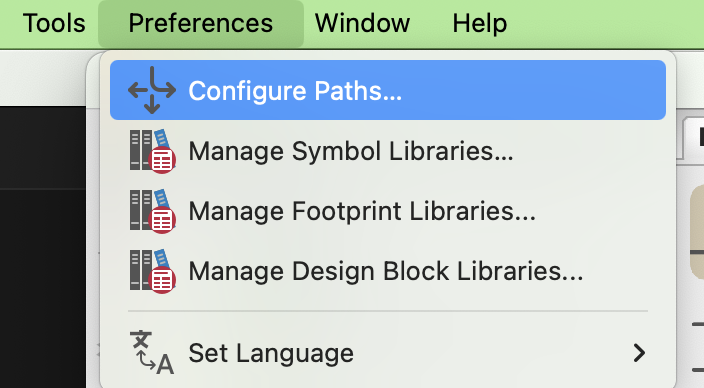
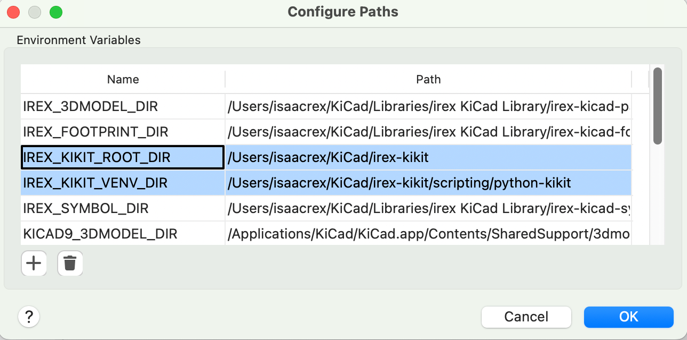

# Overview
This folder contains resources for custom scripts and automation tools for KiCad. The main focus is on the Releaser toolset, which automates the generation of manufacturing files and documentation for PCB designs.

Once you follow the setup instructions below, you should be able to run the releaser in KiCad by simply clicking the "Generate All Destinations" button in the jobset. This assumes your project was started from the KiKit project template, which includes the necessary configurations. 

# Setup

### Python Environment
The tools in this folder are designed to use a `python` environment. The required packages are listed in `requirements.txt`. To make the environment simple and reliable, it is required that you use a virtual environment. To set this up:
- Install Python 3.13
  - Technically, most or all recent versions of Python 3 should work, but this is the version I develop and test with
  - It's recommended to use either `pyenv` or install via homebrew if on macOS. Either way, you just need python available
- Create a virtual environment
    ```bash
    python -m venv ./python-kikit
    ```
- Install the required packages
    ```bash
    ./python-kikit/bin/pip install -r requirements.txt
    ```

### Environment Variables
Some of the tools require certain environment variables to be set. These are expected to be available in KiCad, added via Preferences -> Configure Paths. You can also add them to your shell environment if you need to develop more easily. The required variables are:
- `IREX_KIKIT_VENV_DIR`: The full path to the root of the python virtual environment created above (e.g., `/path/to/irex-kikit/python-kikit`)
- `IREX_KIKIT_ROOT_DIR`: The full path to the root of this repository (e.g., `/path/to/irex-kikit`)




# Implementation Notes

## `execute-command-python` Shim
The current KiCad `execute command` environment is extremely fragile and fails silently with many of the traditional path and environment variable tricks. The current workaround is to use a shell script that activates the virtual environment and then runs the desired tool. Thus, when using scripts from within KiCad, you should use the following command, which sets up the environment and runs python
```bash
${IREX_KIKIT_ROOT_DIR}/scripting/execute-command-python.sh -m kikit_tools.<module> <arguments to module>
```
When running from a regular user environment, you can just `source` the venv activate script and run python directly.
```bash
source ./python-kikit/bin/activate
python -m kikit_tools.<module> <arguments to module>
```
Note when doing this that some expected KiCad environment variables will not be set, so some tools may not work as expected. You can add them to your shell environment adhoc if just testing.

## Execute Command Wrappers
As of the creation of this releasing workflow, the jobset "Execute command" environment is very fragile and does not respect many common environment variable tricks. To work around this, there are two wrapper scripts provided to make it easier to run python tools from within KiCad.
- `execute-command-python.sh`
- `execute-command-python.bat`

These are UNIX and Windows wrappers around the python venv that setup the environment and allow proper execution of python scripts from within KiCad. They're intended to be called from KiCad, but can be used within a terminal as well. In general, they should not be needed from a terminal shell. 

### The polyglot script
Because KiCad on Windows only supports `.bat` files for the "Execute command" (i.e., a call to `execute-command-python` won't auto resolve to `execute-command-python.bat` like it would in a normal cmd prompt), a polyglot script is provided that is both a valid bash script and a valid batch script. This allows you to call `polyglot-execute-command-python.bat` from either environment and have it correctly resolve to the platform-dependant wrapper. It *must* end in `.bat` to work in Windows and macOS doesn't care about the extension.

This is the most "how-ya-doin" part of this setup and I would like to deprecated it once a better solution is found (or created within KiCad). 

This polyglot script is based on the excellent work from [llamasoft](https://github.com/llamasoft/polyshell/blob/master/polyshell.txt).
